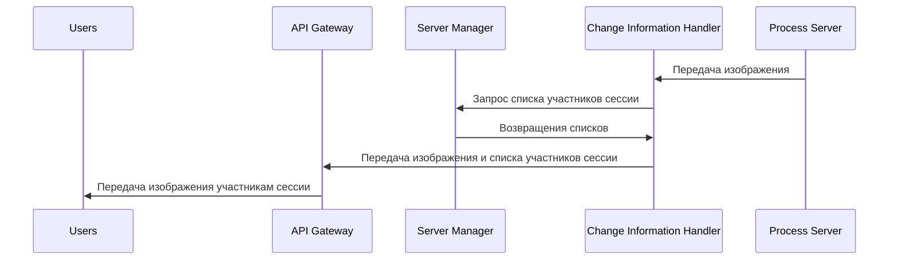
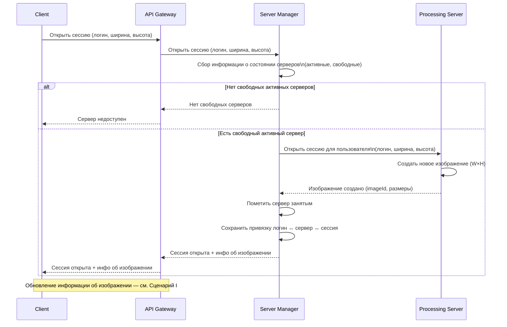
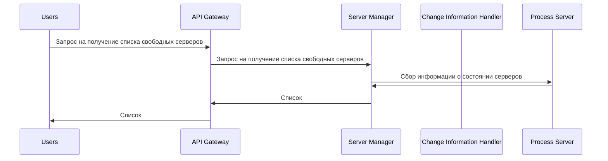
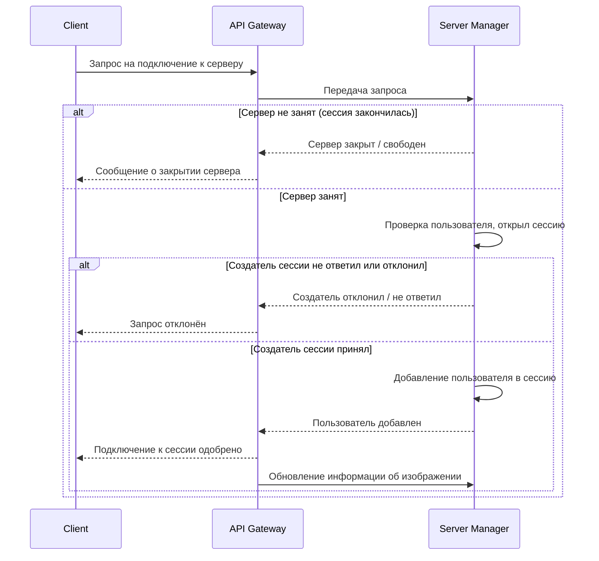
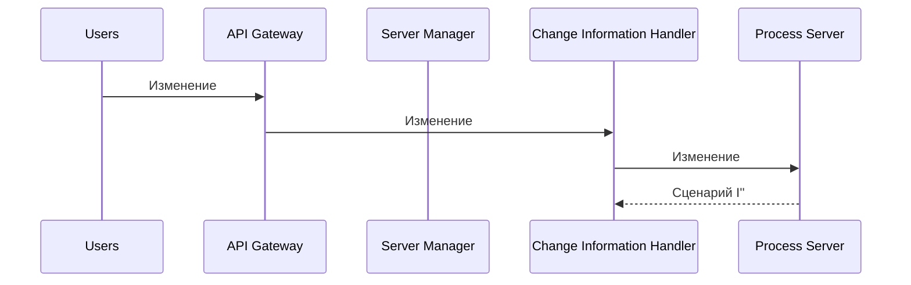
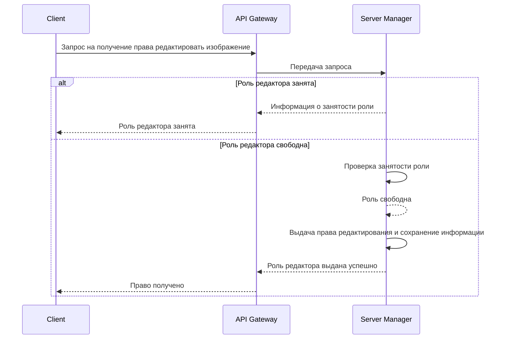
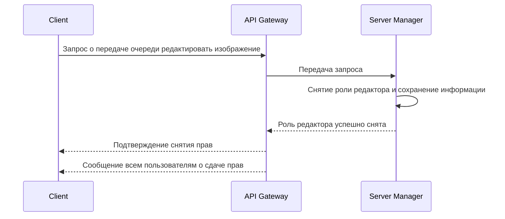

# Техническое решение проекта «OUR Paint»

## Введение
- **Цель проекта:**  
  реализовать прототип распределённой системы для хранения и редактирования изображений.

- **Основания для разработки:**  
  учебный проект в рамках курса «Основы распределённых вычислений».

- **Команда:**  
  Валентина Богдановна, Каширский Дмитрий, Кривонос Екатерина - IT разнорабочие.

## Глоссарий
| Термин        | Определение |
|---------------|-------------|
| Графический интерфейс | Программное обеспечение, предоставляющие пользователю возможность просматривать и изменять изображение. |
| Изображение | Компьютерный файл, хранящий в себе информацию о какой-либо картинке (размер, ширина, длина) и о пикселях, из которых она состоит (цвет, расположение на картинке). |
| Карандаш | Программный инструмент для редактирования изображения, который позволяет добавлять информацию на изображение в виде пикселей. |
| Ластик | Программный инструмент для редактирования изображения, который позволяет убирать информацию на изображении в виде удаления пикселей. |
| Пользователь | Зарегистрированный клиент системы, получивший доступ к просмотру и редактированию изображений. |
| Программный инструмент | Инструмент, с помощью которых пользователи могут редактировать изображение. |
| Просмотр изображения | Возможность открыть файл и увидеть все изменения, произведённые над файлом. |
| Путь к файлу | Доступ к файлу по ссылке. При нажатии по ссылке, пользователю даётся доступ к просмотру, редактированию и сохранению изображения. |
| Редактирование изображения | Изменение информации, хранящейся в изображении. |

## Функциональные требования
Система должна предоставлять следующие функции:

* Просмотр изображений
* Редактирование изображений несколькими пользователями последовательно
  * Инструменты для редактирования изображения:
     * Карандаш
     * Ластик
* Сохранение изображений

Ограничения на предметную область:
1. Графический интерфейс поддерживает одновременное редактирование изображения не более чем 4 пользователями одновременно.
2. Возможно просматривать или изменять изображения размером до 2048 x 2048 пикселей.
3. Сохранить изображение можно будет только в формате PNG или JPG.

## Нефункциональные требования
* Доступность: 80% 
* Время отклика <= 100 мс
* Отказоустойчивость: Система остаётся работоспособной, если по какой-либо причине отключается один из пользователей, участвующих в процессе редактирования изображения. Если отключается сервер, который хранит редактируемое в данный момент изображение, то изображение не утрачивается полностью - любой пользователь, участвовавший в редактировании и не отключившийся от программы, может сохранить последние полученные от сервера данные.
* Консистентность: Изменения, которые внёс один из пользователей во время редактирования изображения также отобразятся у других пользователей, участвующих в процессе редактирования изображения.

## Пользовательские сценарии

I. Создание новой сессии(комнаты) для редактирования изображения:
  1. В соответствующем окне интерфейса пользователь нажимает на кнопку "Создать комнату"
  2. Клиентское приложение посылает запрос на сервер.
  3. Сервер проверяет, есть ли свободные места под комнаты.
  4. Если места есть, сервер создаёт новую комнату и автоматически подключает к ней пользователя.
  5. Если нет, пользователю отправляется сообщение об ошибке.

II. Подключение к сессии:
  1. В соответствующем окне интерфейса пользователь выбирает комнату (из числа доступных), к которой он хочет присоединиться, а затем нажимает на кнопку "Присоединиться"
  2. Клиентское приложение посылает запрос на сервер.
  3. Если комната не успела закрыться за прошедшее время, сервер добавляет клиента в список участников комнаты, иначе отправляет сообщение об ошибке.
  4. Интерфейс переключается на окно редактора.

III. Отключение от сессии:
  1. Пользователь закрывает приложение или нажимает на кнопку выхода в главное меню, которая посылает сигнал.
  2. Сервер отслеживает сигнал или разрыв соединения с пользователем.
  3. Сервер удаляет клиента из числа участников комнаты.

IV. Принятие роли редактора изображения:
  1. Пользователь нажимает на кнопку в интерфейсе, которая посылает запрос на соответствующую сервер.
  2. Сервер смотрит, не занята ли роль редактора в данный момент.
  3. Если не занята - сервер выдаёт пользователю роль редактора.
  4. Если занята - уведомляет его об ошибке.

V. Снятие роли редактора изображения:
  1. Пользователь нажимает на кнопку в интерфейсе, которая посылает запрос на соответствующую сервер.
  2. Сервер смотрит, является ли пользователь редактором.
  3. Если является - сервер снимает роль с пользователя.
  4. Если не является - уведомляет его об ошибке.

VI. Внесение изменения в изображение:
  1. Пользователь выбирает инструмент для редактирования изображение.
  2. Пользователь проводит мышкой по холсту.
  3. Клиентское приложение создаёт запрос, содержащий информацию об изменениях в изображении, и посылает этот запрос на сервер.
  4. Сервер принимает запрос и обрабатывает его, создавая новую версию изображения.
  5. Сервер отправляет новую версию изображения всем участникам соответствующей комнаты.
  6. У всех участников комнаты в графическом интерфейсе отображается новая версия изображения.

##  Архитектура системы

* API Gateway - входная точка в систему, отвечает за маршрутиризацию криентских запросов.
* Server Manager - отвечает за наблюдение за состоянием серверов и распределение пользователей по ним. 
* Processing Server - Отвечает за обработку изменений в изображениях.
* Change Information Handler - Обрабатывает и распределяет информацию об изменениях, внесённых в изображение в процессе редактирования.
* Log Broker - брокер логов, обеспечивающий ассинхронную передачу данных о действиях, произошедших на сервирах, в Logs DB
* Logs DB - База данных, хранящая логи том, что происходило на серверах во время сессий.

**Диаграмма компонентов:**
<https://viewer.diagrams.net/?tags=%7B%7D&lightbox=1&highlight=0000ff&edit=_blank&layers=1&nav=1&title=Rasp.drawio&dark=auto#R%3Cmxfile%3E%3Cdiagram%20name%3D%22%D0%A1%D1%82%D1%80%D0%B0%D0%BD%D0%B8%D1%86%D0%B0%20%E2%80%94%201%22%20id%3D%22AjQ_Fv6i8eFsjXY3NpaH%22%3E7Vxbc6o6FP41PnYPhIvyWC%2B9zLRz3NueOdvHKKlmNoIDWHX%2F%2BpNAgkCwUgsSZugDJYsQzLdWvqy1Euhpo83h0Yfb9atnI6cHFPvQ08Y9AIBimuQflRxjiUr%2BYsnKxzaTnQQz%2FBcxocKkO2yjIFMx9DwnxNuscOm5LlqGGRn0fW%2BfrfbuOdmnbuEKCYLZEjpMCk7S%2F7AdrmPpAPRP8ieEV2v%2BZNW04isbyCuzngRraHv7lEib9LSR73lhfLY5jJBD0eO4xPc9nLma%2FFwfuWGZG3bD%2FevzwsHrhXI3f3DmP63N6x1r5QM6O9Zh9mPDI0fA93aujWgjSk8b7tc4RLMtXNKre6J0IluHG4eUVHIq%2Fij%2BBOSH6JASsR%2F5iLwNCv0jqcKuDhhezGKS8v4EP1CYbJ2CXudCyFS%2BSpo%2BoUJOGDBfAAmIIBEsrHt6HA6j4yA6GtFx3CNQDEB0VCNJXHPC6hA90ZOHqIKSun2YqmZmG0w9Iq8fAmuYVQJ08Mol50uiBOQTAQUfE5u%2BZxc22Lbp7YXazOq7BoVaJRWq1aVPXdDnvwHBKQ%2FsBVOHwTYmnHd8oHBVAZWqZ7HSNBGrQQFUg7qgMloDla43DJXZGqgMo2GoBvLNOsnsccyVL7GUataFkiWg9AhDtIfH9k0BArpq03OAKno%2B99NnIjiHcQPjVjclozi1wBPK44Rc%2B5763dT4HBgEeEnACELoh6I4hV%2FW5NABh7%2FZFXo%2Bp%2FIfBiuND6lq4yMvuKSLv9OF%2BC5g8PLpvqjEbzyrqcDb%2BUt02ZEgnVuhsISxITsTbIiKTynWKFAsl%2FnIgSH%2ByAYuRdpmT5h6mHQtsau%2BlZsPrJzBxB1nd6VDilxDg%2FzEoucaipERGoqML%2Bn2N%2BxRnHN%2FTWZvpK2nt7epaJoE%2Fhe4ICHqlVzpowD%2FhYuoPWo5W9qxqKvGsGeMC23p84GU54IkkGVP6aVjxSKOUH4oCg9GmRZ4UHetlfAq3vt7gOrRm9ZCHqmPRoyORpqlETHKaQmN8HF0PY1wzgDSc4YYtcvPGf36SMPsSKNZ0ui3lTT4QLqeNCRmCQlTC2aJjLYBCoZcfRltVcwtzJD%2FgZcoEOCSPrmQx1crSN0YZgG%2BtSUXuDJT8E59j4AbYHdF5BRrOVKDFshh13TCGYh5mZZA13h2hlNd%2B6BrPCENxICUo6W8Qheu5MCtr%2BVG68BoGDfRKR%2BtoUs8TaA8u%2B%2BevyF%2BgueS0hN0yZQgJYpGwXxxWxTF%2BFPAqZrQJglTTtmMOav5WZTCQ6JTGDRPXSkOic4q6mJkA8qmVfmo7UKbap1oXbTHaG1E2pAmGUBVpFPBwMygL386FYhp8Lr544tLLMU5FfB5UuUbDKKVZRClY5A6LFIT40vJGYQPoW8zyB1dkdFM6TlDTF%2B1gjOap4wun1qP0yHmTCSnDD6CqnA6dMVqm9NRItMqI4H0m2cQ0DFILQwi5r8kZxA%2BhCpxOnSeDOLLDNIziOgk3pZBLq7O3ppBSic%2BOgaph0HEdKbkDMKHUCUMYgDpvQ5N9BJbwRnNU0YXttRDGeLKkdyUkYygKigDqP2s03GnSc8gJV55lJFB6kuWlqaQLllaD4WceRVFXgo5t%2BR6DYWoitW27euaGGi%2BeHSHBWGAP3KscRNUJdudot9skeoa%2Brz9pn%2B%2BL7db5W6KdsUE5urXdCT%2FBl692rUqnoVqDf3qN1u6uib9IzOT6B2T1GKQYiKzJUxS5RKWwm9tDZFwO5bpZQE1%2F7mUog8RqEW72ev7EIEhBihjSEwDBm18XUBEuOBjBIUI1%2Fa%2BgFEYUBBsFY6zAHOwhlt6ujw6mODja5etcxEj%2BbJIBHD5ZxXh%2B88uJM0gJg%2Fir3CpRkWAa2o2SVQUi1i3jEWMa98l%2FHKyR7JscVlPgUe4nadQ8YwjxhyTD8SeJaePkIyVSqKNZFm6PU7CtZvzW7%2B0BDqyaJYsxLBCerKobCN%2BS8ni2iRn67fPKh1ZNEsWYlJMerKoLI9Jd7%2FxvTvykgMPKSWIOmhpinxMukSV3QBhcB64SBhGRxj1WKOY1Jn9fJGYLpLhU8mqM9Ab3KlCiqfvfsfVT59P1yb%2FAw%3D%3D%3C%2Fdiagram%3E%3C%2Fmxfile%3E>

## Технические сценарии

**Сценарий I: Обновление информации об изображении, привязанному к определённому серверу.**
1. Processing Server отправляет изображение Change Information Handler.
2. Change Information Handler отправляет запрос в Server Manager на получение списка клиентов привязанных к Processing Server.
3. Server Manager возвращает этот список Change Information Handler.
4. Change Information Handler отправляет изображение и список пользователей в API Gateway.
5. API Gateway присылает созданное изображение всем клиентам, указанным в списке.

**Сценарий II: Открытие сессии для редактирования нового изображения.**
1. Клиент отправляет запрос в AGI Gateway с параметрами: логин клиента, длина/ширина изображения.
2. API Gateway перенаправляет запрос в Servic Manager.
3. Server Managar собирает информацию о состоянии серверов: какие сервера активны и какие не заняты другими пользователями.
* Если не существует активного свободного сервера:
4. Server Manager отправляет информацию об этом в API Gateway.
5. API Gateway отправляет информацию о недоступности сервера клиенту.
* Если существует активный свободный сервер:
4. Server Manager отправляет запрос на открытие сессии в свободный Processing Server.
5. Processing Server создаёт новое изображение указанной длины и ширины.
6. Processing Server отправляет информацию о создании изображения в Server Manager.
7. Server Manager помечает Processing Server как занятый.
8. Server Manager сохраняет информацию о том, что пользователем под таким-то логином открыл данную сессию и теперь привязан к такому-то серверу.
9. Server Manager отправляет информацию об открытии сервера в API Gateway.
10. API Gateway отправляет информацию об открытии сервера клиенту.
11. Обновление информации об изображении, привязанному к определённому серверу (сценарий I).

**Сценарий III: Запрос списка открытых сессий.**
1. Клиент отправляет запрос в API Gateway на получение списка открытых сессий.
2. API Gateway отправляет запрос Server Manager на получение списка открытых сессий.
3. Server Manager собирает информацию о том, какие сервера на данный момент выделены под сессии (на каждый сервер - одна сессия).
4. Server Manager отправляет список активных сессий в API Gateway.
5. API Gateway отправляет список активных сессий пользователю.

**Сценарий IV: Запрос на подключение к сессии.**
1. Клиент отправляет запрос на подключение к определённому серверу в API Gateway.
2. API Gateway перенаправляет запрос в Server Manager.
3. Server Manager смотрит, занят ли сервер, к которому запрашивают подключение.
* A. Если сервер не занят (сессия успела закончится):
4. Server Manager отправляет информацию о закрытии сервера API Gateway.
5. API Gateway отправляет информацию о закрытии сервера клиенту.
* B. Если сервер занят:
4. Server Manager смотрит, кто из пользователей открыл сессию.
5. Server Manager отправляет в API Gateway запрос на подключение к сессии с информацией о том, кто запросил это подключение и кто открыл сессию на сервере.
6. API Gateway отправляет пользователю, открывшему сессию на сервере, запрос на подключение к сессии пользователя, запросившего подключение к серверу.
* C. Создатель сессии отклонил запрос или не ответил на него в течении определённого времени.
7. API Gateway получает и отправляет информацию об отклоненному запросе клиенту, запросившему подключение к серверу.
  + D. Создатель сессии принял запрос.
7. API Gateway получает и отправляет информацию об принятом запросе клиенту, запросившему подключение к серверу.
8. API Gateway отправляет информацию об принятии запроса в Server Manager.
9. Server Manager добавляет пользователя в список участников сессии, открытой на этом сервере.
10. Обновление информации об изображении, привязанному к определённому серверу (сценарий I).

**Сценарий V: Внесение изменения в изображение. (Для избежания конфликтов в программе пользователи редактируют изображение по очереди. Когда пользователь заканчивает редактировать изображение и подтвержает окончание своей очереди, он освобождает роль редактора изображения. В этот момент любой другой пользователь может занять роль редактора и начать изменять изображение. Пользователь без роли редактора не может вносить изменения в изображения, но может наблюдать за тем, что делает редактор.)**
1. Пользователь как-либо редактирует изображение в свойм клиентском приложении.
2. Клиентское приложение отправляет информацию об изменении API Gateway.
3. API Gateway отправляет эту информацию Change Information Handler.
4. Change Information Handler отправляет эту информацию на нужный Processing Server.
5. Processing Server обрабатывает изменения и применяет их к изображению.
6. Обновление информации об изображении, привязанному к определённому серверу (сценарий I).

**Сценарий VI: Занятие роли редактора | Получение права на редактирование изображение.**
1. Клиент отправляет запрос API Gateway на получение права редактировать изображение.
2. API Gateway передаёт запрос Server Manager.
3. Server Manager смотрит, занята ли роль редактора на определённом сервере.
* A. Роль редактора занята:
4. Server Manager отправляет API Gateway информацию о том, что роль редактора занята.
5. API Gateway перенаправляет информацию пользователю.
* B. Роль редактора не занята.
4. Server Manager выдаёт роль редактора пользователю, запросившему права на редактирование изобраения и сохраняет информацию об этом внутри себя.
5. Server Manager отправляет API Gateway информацию о том, что роль редактора была успешно выдана.
6. API Gateway перенаправляет эту информацию пользователю.

**Сценарий VII: Освобождение роли редактора | Сдача прав на редактирование изображение.**
1. Клиент подаёт API Gateway запрос о передаче очереди редактировать изображение.
2. API Gateway передаёт информацию об этом Server Manager
3. Server Manager снимает роль редактора с пользователя, запросившего снятие прав на редактирование изображения и сохраняет информацию об этом внутри себя.
4. Server Manager отправляет API Gateway информацию о том, что роль редактора была успешно снята.
5. API Gateway перенаправляет эту информацию всем пользователю.

## План разработки и тестирования

- **MVP (необходимый минимум):**
1. Написание клиентского приложения для редактирования изображения с минимальным набором функций и инструментов.
2. Реализация API Gateway, Server Manager, Change Information Handler.
3. Сценарий IV на подключение к сессии урезан и не включает в себя запрос разрешения на подключение к сессии: пользователь подключается к сессии сразу без согласия её создателя.

**DoD (MVP):**
* Работоспособность:
  + Система обеспечивает одновременную работу как минимум для 3 пользователей на одной сессии.
  + Поддержка как минимум 2 разных сессий на разных серверах в одно и то же время.

* Отказоустойчивость:
  + При падении одного Processing Server не затрагивает другие сессии.
  + При падении сервера изображение не устрачивается полностью: пользователи могут сохранить последние полученные от сервера данные.

* Пользовательские сценарии:
  + Пользовательские сценарии реализованы в соответствии с их описанием.

- **Расширенная часть:**
1. Реализация логов (Log Broker, Logs DB).
2. Полная реализация сценария IV, как он описан в пункте "7. Пользовательские сценарии".
3. Добавление дополнительных инструментов для редактирования изображения (ведро/фигуры/поворот...)
4. Возможность загрузки изображение из вне для дальнейшего редактирования.
5. Улучшение отказоустойчивости: когда сервер падает, сессия автоматически переносится на другой.
6. Масштабируемость на 3 и более серверов.
7. Поддержка редактирования одного изображения 4+ людьми.

**DoD (Расширенная часть):**

* Работоспособность:
  + Система обеспечивает одновременную работу как минимум до 8 пользователей на одной сессии.
  + Поддержка до 4 разных сессий на разных серверах в одно и то же время.

* Отказоустойчивость:
  + При падении одного Processing Server не затрагивает другие сессии.
  + При падении сервера сессия переносится на другой свободный сервер без потери данных об изображении. Если свободного сервера нет, программа отправляет последнюю версию изображения пользователям.

* Пользовательские сценарии:
  + Все пользовательские сценарии реализованы в соответствии с их описанием.
